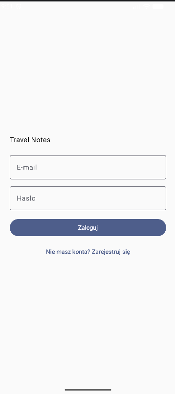
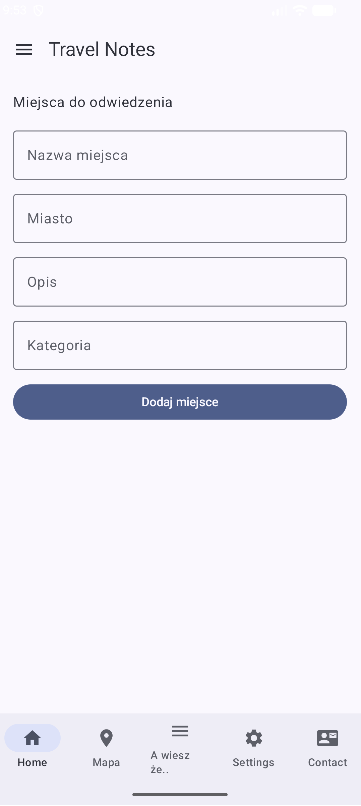
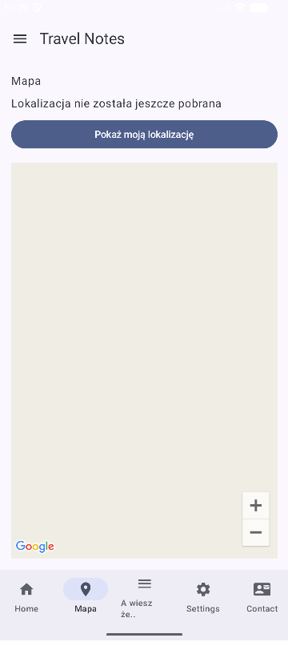
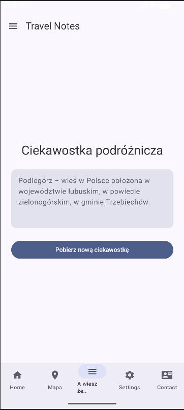
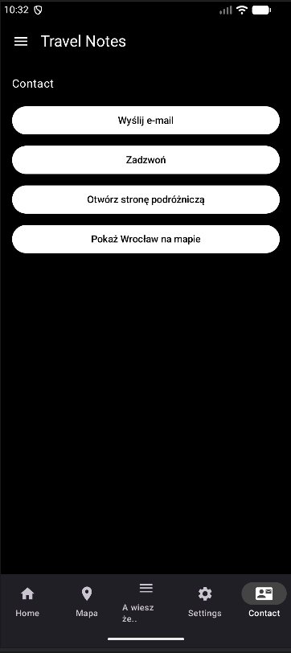
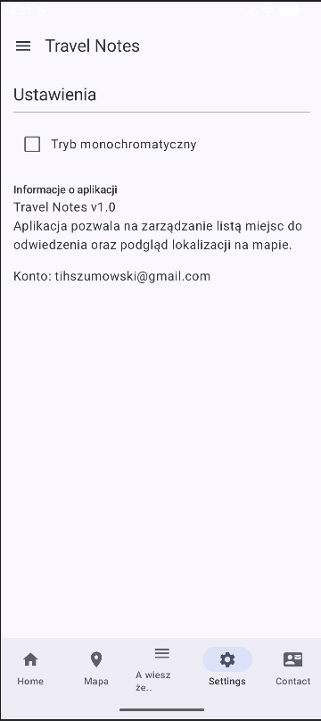
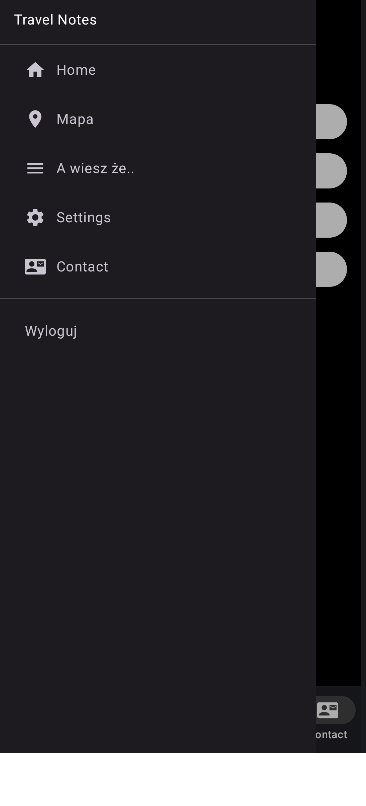
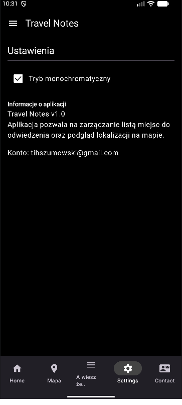

# 🌍 Travel Notes

Aplikacja mobilna na Androida służąca do zapisywania miejsc, które chcesz odwiedzić, oraz zarządzania nimi lokalnie z wykorzystaniem mapy i zewnętrznego API.

---

## 📱 Wygląd aplikacji

| Logowanie | Strona główna | Mapa |
|:---:|:---:|:---:|
|  |  |  |

| Ciekawostki | Kontakt | Ustawienia |
|:---:|:---:|:---:|
|  |  |  |

### 🌑 Tryb Monochromatyczny (Wysoki Kontrast)
Aplikacja posiada funkcję zmiany motywu na czarno-biały (czarne tło, białe napisy), dostępną w ustawieniach.

| Menu boczne | Ustawienia (Ciemne) |
|:---:|:---:|
|  |  |

### 🎥 Nagranie z działania aplikacji


---

## 📱 Opis projektu

**Travel Notes** to nowoczesna aplikacja zbudowana w oparciu o architekturę **MVVM** i **Jetpack Compose**. Umożliwia użytkownikom:
- Rejestrację i logowanie (Firebase Auth).
- Dodawanie i zarządzanie listą wymarzonych podróży (Room Database).
- Podgląd lokalizacji na mapie (Google Maps SDK).
- Wyświetlanie losowych ciekawostek podróżniczych pobieranych z polskiej Wikipedii (Retrofit).
- Integrację z systemem (E-mail, Połączenia telefoniczne, Mapy Google).

---

## 🛠 Konfiguracja i Uruchomienie

Aby poprawnie uruchomić projekt, należy wykonać poniższe kroki:

### 1. Pobranie projektu
```bash
git clone <url-repozytorium>
```

### 2. Konfiguracja pliku local.properties
W głównym folderze projektu stwórz plik `local.properties` (jeśli nie istnieje) i dodaj w nim swój klucz API Google Maps:
```properties
MAPS_API_KEY=TWÓJ_KLUCZ_API_GOOGLE_MAPS
```
Klucz ten jest wymagany do poprawnego działania mapy w zakładce "Mapa".

### 3. Konfiguracja Firebase
Projekt korzysta z Firebase Authentication. Aby go uruchomić:
1. Przejdź do [Firebase Console](https://console.firebase.google.com/).
2. Dodaj nowy projekt i zarejestruj w nim aplikację z pakietem `com.example.lista8`.
3. Pobierz plik `google-services.json` i umieść go w folderze `app/`.
4. W sekcji **Authentication** włącz metodę logowania **E-mail/Hasło**.

---

## 🚀 Funkcje aplikacji

### 🔐 Bezpieczeństwo
- **Firebase Authentication**: Logowanie i rejestracja użytkowników.
- **Zabezpieczenie tras**: Dostęp do głównej części aplikacji tylko dla zalogowanych.

### 🏠 Zarządzanie Miejscami (Room)
- Pełny CRUD (Create, Read, Update, Delete).
- Pola: Nazwa miejsca, Miasto, Opis, Kategoria.
- Możliwość oznaczania miejsc jako "odwiedzone".

### 🗺️ Mapa (Google Maps SDK)
- Wyświetlanie markerów.
- Funkcja "Pokaż moją lokalizację" (wymaga uprawnień GPS).
- Animacja kamery do aktualnej pozycji użytkownika.

### 📖 Ciekawostki (Retrofit + Wikipedia API)
- Pobieranie losowych streszczeń z polskiej Wikipedii jako ciekawostek podróżniczych.
- Obsługa stanów ładowania i błędów (np. brak internetu).

### 📞 Kontakt i Narzędzia
- Bezpośredni e-mail do twórców.
- Szybki dialer (numer telefonu).
- Przekierowanie do zewnętrznych usług turystycznych w przeglądarce.

---

## 🧱 Technologie

- **Język**: Kotlin
- **UI**: Jetpack Compose
- **Architektura**: MVVM (ViewModel, LiveData/StateFlow)
- **Baza danych**: Room (SQLite)
- **Networking**: Retrofit + OkHttp (JSON Gson)
- **Backend**: Firebase Authentication
- **Mapy**: Google Maps SDK for Android
- **Nawigacja**: Jetpack Navigation Compose

---

## 📂 Struktura projektu

```bash
app/src/main/java/com/example/lista8/
 ├── data/           # Modele danych i konfiguracja Room (Entity, DAO, Database)
 ├── viewmodel/      # Logika biznesowa (PlaceViewModel, SettingsViewModel)
 ├── ui/theme/       # Konfiguracja motywu, kolorów i typografii Compose
 ├── MainActivity.kt # Główna aktywność i nawigacja aplikacji
 ├── TravelViewModel.kt # ViewModel dla ciekawostek z API
 ├── RetrofitClient.kt # Konfiguracja klienta HTTP
 └── TravelService.kt # Interfejs API Wikipedii
```
